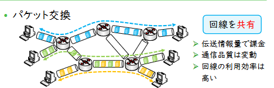
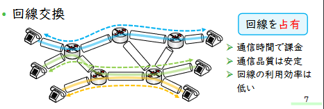
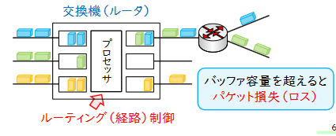
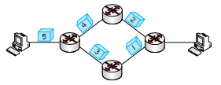
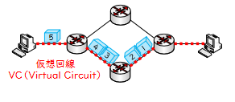

# 情報ネットワーク
通信回線でコンピュータを接続したシステム

# インターネット
ネットワークを相互接続したもの
- The Internet
  - ネットワークのネットワーク
  - インターネット全体を管理する組織はいない
## 概要(概略図)

- ホスト間をスイッチで接続
- ルータで外部に接続。**ISP(Internetn Service Provider)** がルータ間のスイッチングを行い、接続を行う。
## 通信方式
### パケット交換方式
- 情報をビット列に符号化
- **パケット** というブロックに分割、送受信
- パケットをバッファメモリに蓄積、適切な出力線に転送→**遅延時間の揺らぎ**

**パケット交換**

**回線交換**

**コネクションレス型**

- データグラム方式
- パケットが独立に転送
- 通信品質を保証しにくい
- UDP等で体操

**仮想回線方式**

- 
