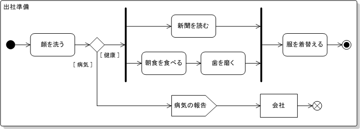

# 並行と並列
時間効率性を高める手段。
並列：物理的に同時に実行すること
- 別々のプロセッサをそれぞれの処理に割り当てる
並行: 概念的に同時に実行する。(同時に実行されているかの如くふるまう)
- プロセッサを高速に切り替えながら行うなど。

非同期: 処理をしている最中に別の処理を行うということ

# 時間的な結合を破壊する。
設計要素としての時間には二つの要素がある。
- **並行性:** 同時に発生すること
- **順序:** 時間軸上における位置関係
## 並行部分を探す
アプリケーションのワークフロー(役割関係)をモデル化しで分析する必要がある。

この時どういったことが起こりえるか、それがどういった順序で起こらなければならないかを洗い出す必要がある

**並行性を向上させるためにワークフローを分析する**

ワークフロー分析の一つに以下のようなアクティビティ図がある。

図における太線は**同期バー**と呼ばれ、そのタスクが終わってから次のタスクに移行するという仕組みである。

## 並行処理の機会
アクティビティ図は並行処理が可能な場所はわかるがどの作業を並行処理でやるべきかはわからない。

その際のわかりやすい並行処理の使いどころは、外部サービスへのアクセスや、ユーザーからの入力待ち等の時間にやらせるべきである。

## 並列処理の機会
並行処理はソフトウェアの物事だが、並列処理はハードウェアにかかわる物事。

複数のプロセッサが環境にあれば処理時間の短縮が可能。

- 分割した個々の作業が比較的独立している
- ほかの作業を待っている。

といったときに並列処理を扱うことができる。